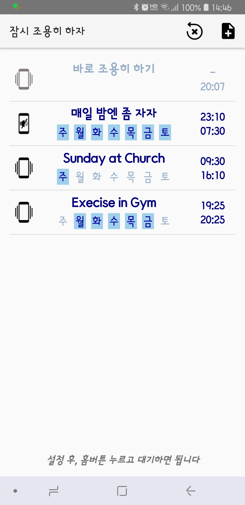
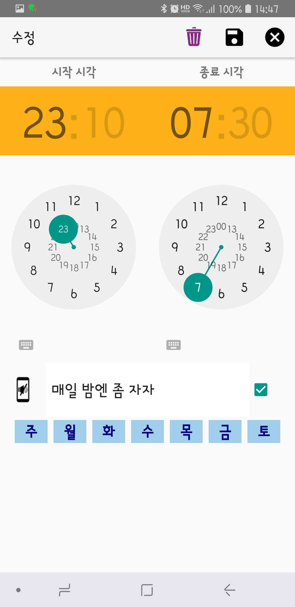

# Keep It Down (Be quiet, manner mode)
<b>Keep It Down</b> is the android application to support periodic silence setting (aka <i>manner mode</i>)

- you can set weekly based periodic silents time
- you can make the phone silent for a while immediately
<H1>Screenshots and How to operate</H1>

<H3> mainActivity</H3>

- Screen when this app is invoked
- You can press one of the items to edit
- First item is used for immediate silence (it shows no weekday information)
- Press  to reset all defined list
- Press  to add new item
- Items will be grayed if it is not active

 &nbsp;&nbsp;&nbsp;&nbsp;&nbsp;&nbsp;&nbsp;&nbsp;&nbsp;&nbsp;&nbsp;&nbsp;
    

<H3>addActivity</H3>

- Screen when add or update is requested
- Left time is for start (go into silent)
- Right time is for finish (return to normal)
- You may change start/finish time by clicking clock images or times displayed
- You may change time thru digital clock by clicking keyboard icon 
- Clicking  will toggle whether to allow phone vibrating or not
- Subject can be edited as you want
- Check mark is toggle for active or not
- Top menu icon  will delete this item immediately.
- Top menu icon   will save item and go back to main Activity screen
- Top menu icon   will ignore current change and go back to main Activity screen.

 &nbsp;&nbsp;&nbsp;&nbsp;&nbsp;&nbsp;&nbsp;&nbsp;&nbsp;&nbsp;&nbsp;&nbsp;

<H3>timerActivity</H3>
 
- Screen when first item (immediate silent) is pressed  
- Default duration is after 60 minutes (1 hour) from now
- You may change finish time by clicking clock images or up down button showing after duration time (01:00)
- Up/down 10 mins and up/down 30 mins buttons are provided
- Vibrate toggle also is provided
- Top menu icon   will save item and go back to main Activity screen,and phone will go into silent mode till finish time you have set.
- Top menu icon   will ignore current change and go back to main Activity screen.

 &nbsp;&nbsp;&nbsp;&nbsp;&nbsp;&nbsp;&nbsp;&nbsp;&nbsp;&nbsp;&nbsp;&nbsp;

<H1>Coded By</H1>

- Woncherl Ha - riopapa@gmail.com

<H1>Issues not fixed yet</H1>

- When phone is rebooted, every itmes should be loaded and saved by you, sorry :-(

<H3>Thanks all persons in GitHub for good examples.</H3>

