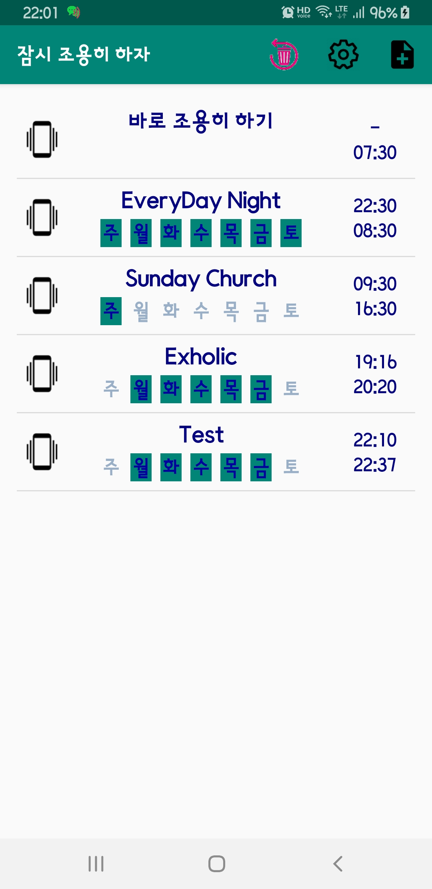

# Keep It Silent (Let phone in Manner mode)
**Keep It Silent** is the android application to support periodic silence setting, e.g. every nights

- you can set weekly based periodic silents time, week name selectable
- you can make the phone silent for a while immediately
<H1>Screenshots and How to operate</H1>

<H3> mainActivity</H3>

- Screen when this app is invoked
- You can press one of the items to edit
- First item is used for immediate silence (it shows no weekday information)
- Press  to reset all defined list. It deletes all the defined tasks and create two activities (1st: immediate slient, 2nd: default generated)
- Press  to add new item
- Items will be grayed if it is not active

 &nbsp;&nbsp;&nbsp;&nbsp;&nbsp;&nbsp;&nbsp;&nbsp;&nbsp;&nbsp;&nbsp;&nbsp;
    

<H3>addActivity</H3>

- Screen when add or update is requested (WHen it's new, delete button  will not be enabled)
- Left time is for start (go into silent)
- Right time is for finish (return to normal)
- You may change start/finish time by clicking clock images or times displayed
- You may change time thru digital clock by clicking keyboard icon
- Clicking  will toggle whether to allow phone vibrating or not
- Subject can be edited as you want
- Check mark is toggle for active or not
- Touching week name will toggle on that day.
- Top menu icon  will delete this item immediately.
- Top menu icon   will save item and go back to main Activity screen
- Top menu icon   will ignore current change and go back to main Activity screen.

 &nbsp;&nbsp;&nbsp;&nbsp;&nbsp;&nbsp;&nbsp;&nbsp;&nbsp;&nbsp;&nbsp;&nbsp;

<H3>OneTimeActivity</H3>

- Screen when first item (immediate silent) is pressed  
- Default duration is after 60 minutes (1 hour) from now
- You may change finish time by clicking clock images or up down button showing after duration time (01:00)
- Up/down 10 mins and up/down 30 mins buttons are provided
- Vibrate toggle also is provided
- Top menu icon   will save item and go back to main Activity screen,and phone will go into silent mode till finish time you have set.
- Top menu icon   will ignore current change and go back to main Activity screen.

 &nbsp;&nbsp;&nbsp;&nbsp;&nbsp;&nbsp;&nbsp;&nbsp;&nbsp;&nbsp;&nbsp;&nbsp;

<H3>SettingActivity</H3>

- Some parameters adjusting is provided in this screen
- Sound On/Off when switching to Manner Mode On/Off
- Immediate time adjust interval : short time interval, long time interval, default duration
- ReEecute all the tasks now

 &nbsp;&nbsp;&nbsp;&nbsp;&nbsp;&nbsp;&nbsp;&nbsp;&nbsp;&nbsp;&nbsp;&nbsp;

<H1>Comments</H1>

- Coded by **Woncherl Ha** - riopapa@gmail.com
- When return time comes, it reactivate vibration to normal regardless you were in manner mode

<H3>Updates / Changes</H3>
- 2019.02.07 Boot Receiver added : all tables are read and set broadcasting again when booted

<H3>What I learned in this application</H3>
- listViewAdapter, time picker, menu.xml, Pending Intent id update, Object putExtras/getExtras, Sqlite handling, ..

<H1>Issues not fixed yet</H1>

- ~~When phone is rebooted, to active all the event, I force to run this app, so mainActivity will be displayed after boot completion~~ <= add boot receiver
- ~~A SQLiteConnection object for database .. was leaked !~~ <== add cursor close
- ~~When it goes to normal status, main Activity is shown in foreground~~ <= add status check to reshow list or not

<H3>Thanks to all persons in GitHub for good examples.</H3>

